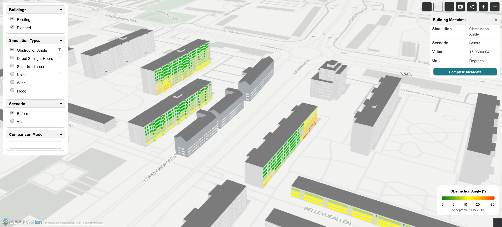
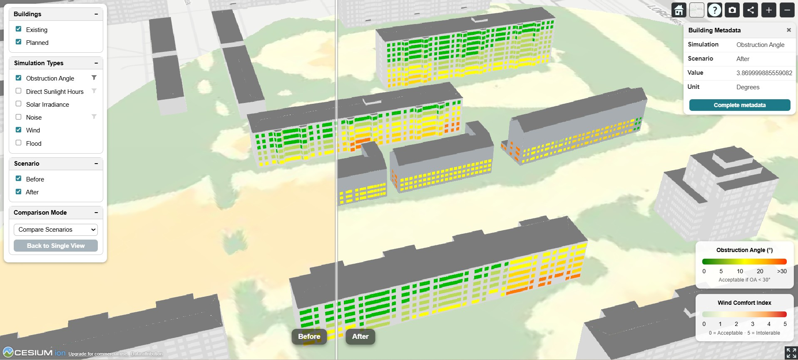
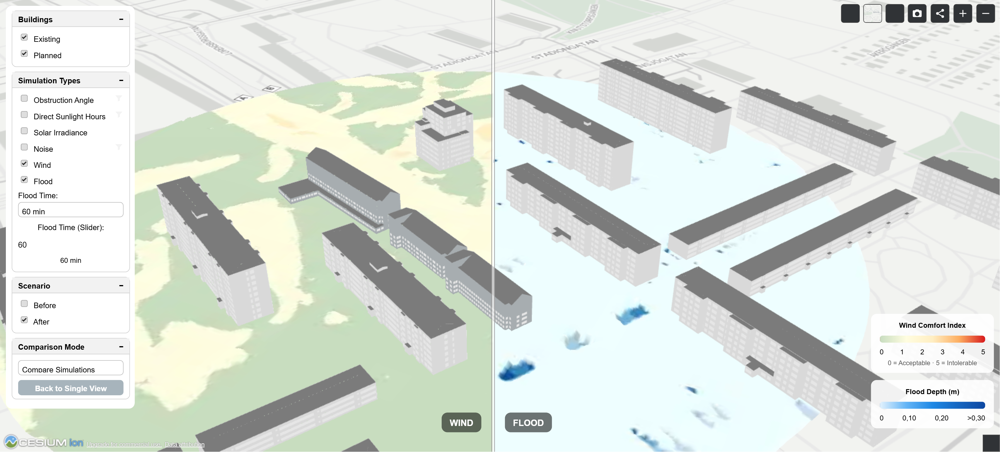
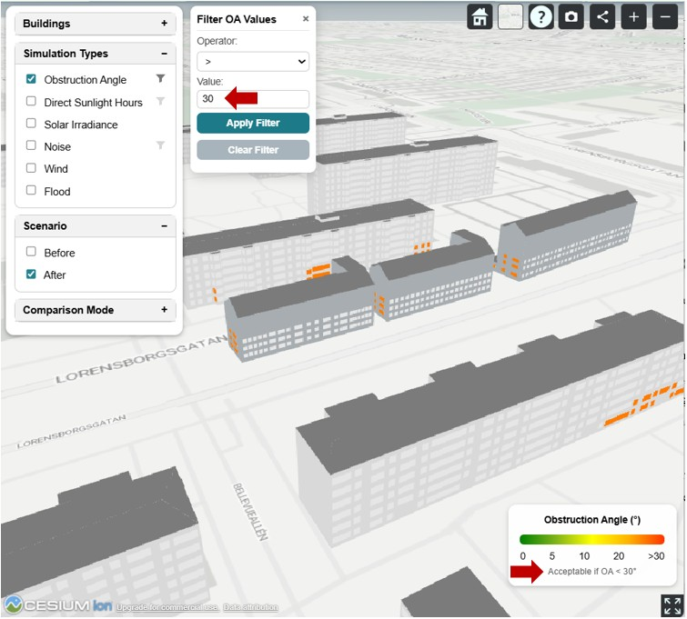
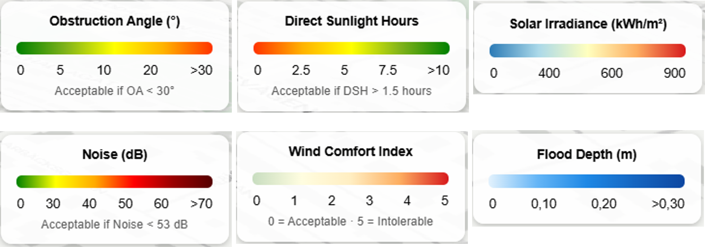
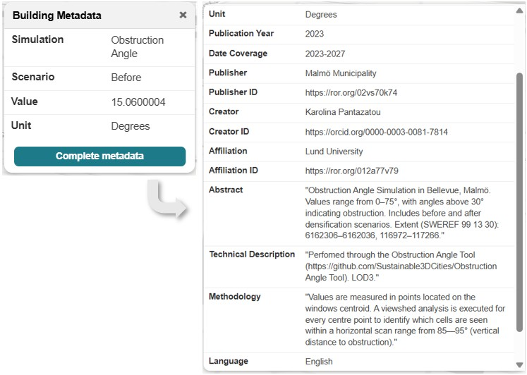

# 3D City Visualization Tool
Web-based tool for visualizing environmental simulations in semantic 3D city models

## Overview
This project presents a web-based visualization tool for exploring and analyzing environmental simulation results (e.g., daylight, noise, wind, flood) integrated with semantic 3D city models.

The tool is designed to support urban planners and decision-makers by enabling:

- Interactive exploration of simulation results in 3D
- Comparison between scenarios and simulations
- Identification of critical areas
- Clear communication of complex environmental data

It is built using CesiumJS and 3D Tiles for efficient streaming of large geospatial datasets.

It is designed as a template, meaning:
- No data is included
- Users can plug in their own datasets

---

## Main features
- Layer-based visualization
- Support multiple environmental simulations
- Scenarios comparison

  

- Simulation type comparison

  

- Filtering critical areas

  

- Legends and thresholds

  

- Metadata popup (expandable for complete set of information)

  

---
## System Architecture 

### Input data
- 3D city model (CityGML - LOD2/LOD3)
- Simulation outputs (CSV, raster, point data)

  

### Database key processes
- link simulation output to geometry (windows, walls, terrain)
- assign appearances (colors, textures)
- PostgreSQL + PostGIS in 3DCityDB

### Data processing
- ETL performed using FME
- Convert CityGML into 3D Tiles for each scenario and simulation type

### Visualization 
- CesiumJS
- 3D tiles streamed via Cesium ion

---
## Recommendation - Data consistency

This tool assumes that all simulation datasets are based on a common 3D city model.

To ensure accurate visualization and comparison, it is recommended to:

- Use a standardized 3D city model
- Perform all simulations using the same geometric reference
- Maintain consistent identifiers or spatial relationships between geometry and simulation outputs

This approach ensures that simulation results are correctly mapped to their corresponding 3D elements, enabling reliable analysis and comparison between different simulations and scenarios.

In addition, using a standardized 3D city model supports scalability and future reuse of the tool. Once a consistent model is established, new simulations, scenarios, or study areas can be integrated more easily without restructuring the entire workflow. This makes the tool adaptable to different projects and long-term urban analysis processes.

---

## Use cases
- Urban planning analysis
- Scenario evaluation
- Stakeholder and communication

---

## Limitations
- Requires technical setup
- Not a legal document tool
- Performance depends on dataset size and tiling
- Limited photorealism (phocus on analysis)

---

## Future Improvments
- Dashboard with aggregated statistics
- Export to Google Earth
- Integration with urban planning workflows
  
